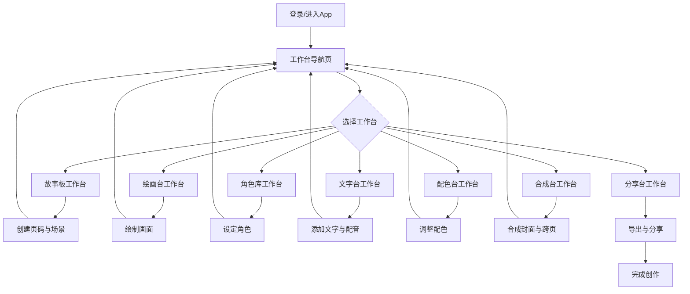

## 1. 产品概述
彩虹绘本工坊是一款面向儿童绘本创作者和亲子共创家庭的创意设计平板App。通过7个专业工作台的协作式流程，让每个家庭都能轻松创作属于自己的专属绘本。
- 目标用户：6-12岁儿童及其家长、绘本爱好者、亲子教育工作者
- 核心价值：降低绘本创作门槛，提供从故事构思到成品分享的全流程工具

## 2. 核心功能

### 2.1 用户角色
| 角色 | 注册方式 | 核心权限 |
|------|----------|----------|
| 儿童创作者 | 家长账号创建 | 使用所有创作工具，创作和编辑绘本 |
| 家长 | 邮箱/手机号注册 | 管理账号、设置评论权限、导出作品 |
| 教育工作者 | 邮箱注册 | 创建班级绘本、批量管理学生作品 |

### 2.2 功能模块
1. **故事板工作台**：页码管理、场景创建、角色关系图谱
2. **绘画台工作台**：画笔工具、贴纸素材、纹理库、图层管理、撤销重做
3. **角色库工作台**：角色表情、服装搭配、姿势动作库
4. **文字台工作台**：气泡对白、旁白文字、字体库、朗读预览
5. **配色台工作台**：主题配色推荐、画面统一性检查
6. **合成台工作台**：封面生成、跨页排版、缩略图预览
7. **分享台工作台**：PDF导出、图片集打包、朗读视频生成、家人评论权限

### 2.3 页面详情
| 页面名称 | 模块名称 | 功能描述 |
|----------|----------|----------|
| 工作台导航页 | 工作台卡片 | 7个工作台入口、最近项目、新建项目按钮 |
| 故事板工作台 | 页码列表 | 添加/删除/排序页码、跳转编辑 |
| 故事板工作台 | 场景画布 | 场景缩略图编辑、背景设置 |
| 故事板工作台 | 角色关系图 | 角色节点拖拽、关系连线、关系标签 |
| 绘画台工作台 | 画笔工具栏 | 铅笔/水彩/蜡笔/马克笔、颜色选择器、粗细调节 |
| 绘画台工作台 | 素材面板 | 贴纸分类、纹理库、拖拽使用 |
| 绘画台工作台 | 图层面板 | 图层列表、上下移动、可见性、锁定、合并 |
| 角色库工作台 | 角色管理 | 新建/编辑/删除角色、角色分类 |
| 角色库工作台 | 表情库 | 预设表情、自定义表情编辑 |
| 角色库工作台 | 服装间 | 上衣/裤子/配饰、颜色更换 |
| 角色库工作台 | 姿势库 | 静态姿势、动态姿势、拖拽应用 |
| 文字台工作台 | 文字编辑 | 气泡样式、旁白框、字体大小颜色 |
| 文字台工作台 | 字体库 | 可爱体/手写体/卡通体、中英文支持 |
| 文字台工作台 | 朗读预览 | 语音选择、语速调节、实时播放 |
| 配色台工作台 | 主题推荐 | 童话风/森林系/梦幻紫等主题色板 |
| 配色台工作台 | 统一检查 | 色彩饱和度、明度一致性检测与建议 |
| 合成台工作台 | 封面设计 | 书名编辑、作者署名、自动版式 |
| 合成台工作台 | 跨页排版 | 左右页拼接、中缝处理、预览调整 |
| 合成台工作台 | 缩略图生成 | 全页缩略预览、快速跳转、导出 |
| 分享台工作台 | 导出面板 | PDF导出选项、图片质量、打包下载 |
| 分享台工作台 | 朗读视频 | 背景音乐、自动翻页、MP4导出 |
| 分享台工作台 | 权限管理 | 家人列表、评论开关、编辑权限 |

## 3. 核心流程
用户从工作台导航页选择创作流程，依次通过故事板构思→绘画创作→角色设定→文字润色→配色调整→合成输出→分享成品的完整路径完成绘本创作。每个工作台可自由跳转，支持非顺序化创作。

## 4. 用户界面设计

### 4.1 设计风格
- **主色调**：彩虹渐变系统，主色采用温暖的珊瑚橙 #FF6B6B，辅助色为天空蓝 #4ECDC4 和柠檬黄 #FFE66D
- **中性色**：奶油白 #FFF8E7 为底色，搭配深棕灰 #5D4E37 文字
- **按钮风格**：圆润糖果按钮，8-16px圆角，轻微立体投影，点击有弹性反馈
- **字体**：标题使用圆润手写风「ZCOOL KuaiLe」，正文使用清晰易读的「Noto Sans SC」
- **布局风格**：卡片式布局，每个工作台为独立场景空间，左侧工具栏+中间画布+右侧属性面板
- **图标风格**：手绘风描边图标，圆角粗线条，配合糖果色填充
- **装饰元素**：页面角落添加云朵、星星、彩虹等童趣装饰，柔和的背景渐变

### 4.2 页面设计概览
| 页面名称 | 模块名称 | UI元素 |
|----------|----------|--------|
| 工作台导航页 | 工作台卡片 | 渐变色圆角卡片、发光悬停效果、弹跳动画、功能图标 |
| 故事板工作台 | 页码时间轴 | 横向滚动缩略图、拖拽排序、高亮当前页 |
| 故事板工作台 | 关系图 | 彩色节点、弯曲线条、标签气泡、磁吸对齐 |
| 绘画台工作台 | 画布区域 | 全屏画布、网格可选、双指缩放和平移、边缘阴影 |
| 绘画台工作台 | 工具栏 | 底部悬浮工具条、滑动选择画笔、实时笔刷预览 |
| 绘画台工作台 | 图层面板 | 右侧抽屉式面板、图层卡片、上下滑动排序 |
| 角色库工作台 | 角色预览 | 3D翻转卡片、表情快捷切换轮播 |
| 角色库工作台 | 服装搭配 | 左右分栏、拖拽穿衣、实时预览 |
| 文字台工作台 | 气泡库 | 瀑布流气泡样式、一键应用、可拖拽调整 |
| 文字台工作台 | 朗读面板 | 波形动画、播放按钮呼吸光效、进度彩虹条 |
| 配色台工作台 | 色板推荐 | 圆形色卡、渐变过渡、点击应用全画 |
| 配色台工作台 | 检查报告 | 卡片式建议、绿色通过/黄色警告标识 |
| 合成台工作台 | 3D预览 | 翻转书籍效果、阴影质感、翻页动画 |
| 分享台工作台 | 导出选项 | 卡片式选择、勾选动画、进度条彩虹填充 |

### 4.3 响应式
- 平板优先（1024x768及以上），横向布局为主
- 触控优化：所有按钮最小触控区域 48x48pt，支持多指手势
- 画布区域自适应，工具栏在小屏时折叠为图标模式
- 关键操作提供震动反馈（支持的设备）

### 4.4 动效设计
- 页面切换：卡片翻转动画，300ms 缓动
- 按钮交互：按下缩放 0.95，回弹使用弹性曲线
- 画布绘制：笔刷轨迹实时渲染，带轻微拖尾
- 切换工作台：当前卡片飞出，新卡片从彩虹门飞入
- 加载状态：小彩虹旋转动画 + 进度提示
