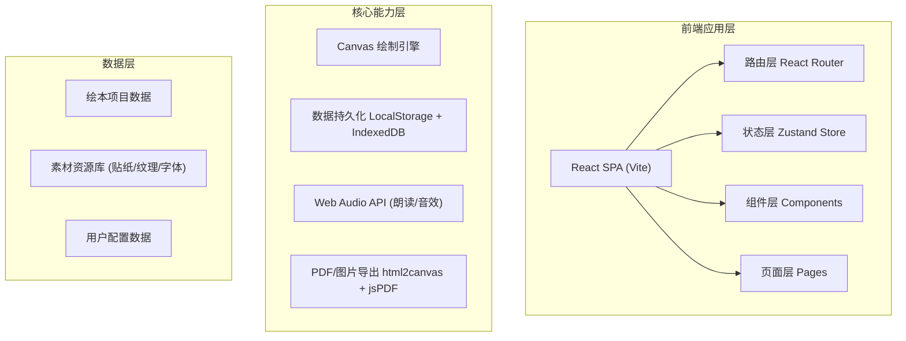
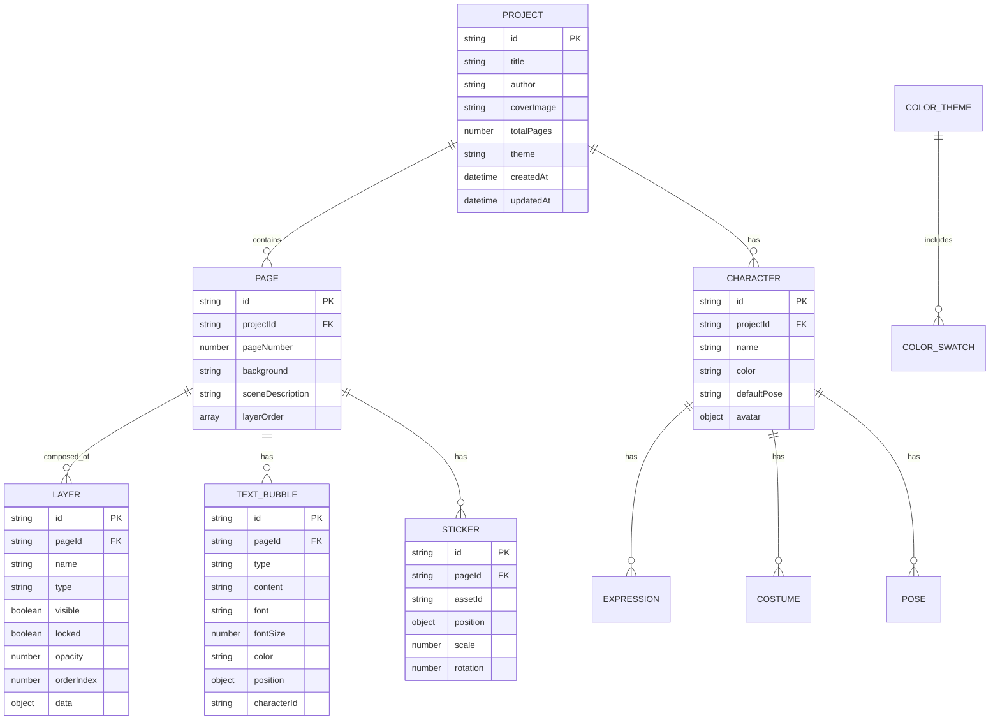

## 1. 架构设计
纯前端单页应用架构，使用React + TypeScript构建，状态管理采用Zustand，画布绘制使用Canvas 2D API，UI组件配合Tailwind CSS和自定义动画。



## 2. 技术描述
- **前端框架**：React@18 + TypeScript@5 + Vite@5
- **样式方案**：TailwindCSS@3 + CSS Variables (主题系统) + Framer Motion (动画)
- **状态管理**：Zustand@4 (全局状态) + React Context (主题)
- **路由管理**：React Router Dom@6
- **图标库**：Lucide React (内置图标) + 自定义SVG手绘图标
- **画布核心**：原生Canvas 2D API + 自定义绘制命令模式
- **导出能力**：html2canvas + jsPDF
- **数据存储**：LocalStorage (轻量配置) + IndexedDB (项目/素材大文件)
- **初始化工具**：vite-init (react-ts模板)

## 3. 路由定义
| 路由 | 用途 |
|------|------|
| / | 工作台导航首页，展示7个工作台入口和最近项目 |
| /workspace/storyboard | 故事板工作台 |
| /workspace/painting | 绘画台工作台 |
| /workspace/characters | 角色库工作台 |
| /workspace/text | 文字台工作台 |
| /workspace/color | 配色台工作台 |
| /workspace/composite | 合成台工作台 |
| /workspace/share | 分享台工作台 |

## 4. 数据模型

### 4.1 核心数据模型定义


### 4.2 TypeScript 核心类型
```typescript
interface Project {
  id: string;
  title: string;
  author: string;
  coverImage?: string;
  totalPages: number;
  theme?: ColorTheme;
  createdAt: Date;
  updatedAt: Date;
}

interface Page {
  id: string;
  projectId: string;
  pageNumber: number;
  background: BackgroundData;
  sceneDescription: string;
  layers: Layer[];
  textBubbles: TextBubble[];
  stickers: Sticker[];
  characterRelations: CharacterRelation[];
}

type LayerType = 'sketch' | 'paint' | 'sticker' | 'character' | 'text' | 'background';

interface Layer {
  id: string;
  pageId: string;
  name: string;
  type: LayerType;
  visible: boolean;
  locked: boolean;
  opacity: number;
  orderIndex: number;
  data: CanvasData | CharacterInstance | StickerInstance;
}

interface Character {
  id: string;
  projectId: string;
  name: string;
  color: string;
  avatar: string;
  expressions: Expression[];
  costumes: Costume[];
  poses: Pose[];
}

interface DrawingTool {
  id: string;
  type: 'pencil' | 'watercolor' | 'crayon' | 'marker' | 'eraser';
  color: string;
  size: number;
  opacity: number;
}
```

## 5. 项目目录结构
```
src/
├── components/           # 可复用组件
│   ├── layout/          # 布局组件（侧边栏、顶栏、画布容器）
│   ├── common/          # 通用UI（按钮、卡片、弹窗、滑块）
│   ├── storyboard/      # 故事板相关组件
│   ├── painting/        # 绘画台相关组件（画布、工具栏、图层）
│   ├── characters/      # 角色库相关组件
│   ├── text/            # 文字台相关组件
│   ├── color/           # 配色台相关组件
│   ├── composite/       # 合成台相关组件
│   └── share/           # 分享台相关组件
├── pages/               # 路由页面
│   ├── Home.tsx         # 工作台导航页
│   ├── Storyboard.tsx
│   ├── Painting.tsx
│   ├── Characters.tsx
│   ├── Text.tsx
│   ├── Color.tsx
│   ├── Composite.tsx
│   └── Share.tsx
├── store/               # Zustand状态管理
│   ├── projectStore.ts
│   ├── drawingStore.ts
│   ├── characterStore.ts
│   └── uiStore.ts
├── hooks/               # 自定义Hooks
│   ├── useCanvas.ts
│   ├── useDrawing.ts
│   ├── useExport.ts
│   └── useLocalStorage.ts
├── utils/               # 工具函数
│   ├── canvas.ts
│   ├── color.ts
│   ├── export.ts
│   ├── id.ts
│   └── mockData.ts
├── types/               # TypeScript类型定义
│   └── index.ts
├── assets/              # 静态资源
│   ├── stickers/
│   ├── textures/
│   ├── fonts/
│   └── icons/
├── App.tsx
├── main.tsx
├── index.css
└── router.tsx
```

## 6. 核心模块实现策略

### 6.1 画布绘制引擎
- 采用命令模式：每个绘制操作封装为DrawCommand，支持撤销/重做栈
- 双缓冲Canvas：离屏Canvas进行栅格化，主Canvas负责显示
- 图层系统：每个Layer对应独立的离屏Canvas，合成时按orderIndex渲染

### 6.2 数据持久化
- 项目元数据存储于LocalStorage
- 画布快照、素材资源存入IndexedDB
- 自动保存防抖：修改后3秒自动持久化

### 6.3 导出模块
- PDF：逐页html2canvas截图 → jsPDF拼接
- 图片集：批量Canvas.toBlob打包为ZIP
- 朗读视频：结合MediaRecorder录制Canvas + Audio

### 6.4 Mock数据策略
- 预置3个示例项目数据
- 50+贴纸素材（分类：动物、植物、天气、装饰）
- 8种主题配色方案
- 6种预设角色模板
- 12种字体（手写体、卡通体等）
